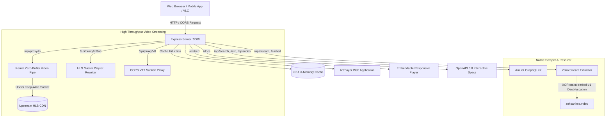

# ⚡ Zoko - Pure Express Anime Streaming & Scraping Engine

A state-of-the-art, high-performance reverse-engineered anime streaming and scraping engine built with **100% Pure Node.js & Express.js** (zero Python, zero FastAPI, zero external scraper dependencies).

---

## 🏛️ System Architecture



---

## 🌟 Key Features

- ⚡ **Pure Node.js / Express:** Zero Python, zero external scraper daemons. Ultra-lightweight memory footprint (~40 MB).
- 🔓 **Reverse-Engineered Zoko Stream Decryption:** XOR cipher deobfuscation (`otaku-embed-v1`) extracting master HLS playlists, multi-language subtitles (`.vtt`), and auto-skip intro/outro timestamps.
- 🚀 **High-Concurrency Undici Pipeline:** Optimized connection pool (`pipelining: 0`, `connections: 128`) preventing Cloudflare edge socket stalls and DNS timeouts.
- 🛡️ **Zero-Error HLS Proxy:** Rewrites master & variant playlists on the fly to bypass upstream CORS and 403 Forbidden hotlink blocks.
- ⚡ **Zero-Copy Kernel Video Piping:** Video TS chunks stream directly from upstream network socket to browser with `Readable.fromWeb().pipe(res)` and HTTP Range 206 partial content support.
- 🎬 **Integrated Responsive ArtPlayer:** Full-featured dark-mode player with Sub/Dub audio switcher, episode navigator, auto-skip intro/outro, and theater mode.
- 📦 **Embed Route (`/embed`):** Drop-in iframe support for embedding into any external website or mobile webview.
- 📖 **Interactive Swagger UI:** OpenAPI 3.0 specs available at `/docs`.

---

## ⚙️ Environment Variables (.env / .env.example)

| Variable | Default | Description |
| :--- | :--- | :--- |
| `PORT` | `3000` | Port for the Express server |
| `HOST` | `127.0.0.1` | Network interface (`127.0.0.1` for local, `0.0.0.0` for Docker) |
| `RATE_LIMIT_MAX` | `120` | Max requests per minute per IP |
| `CACHE_TTL_MS` | `180000` | Cache time-to-live in milliseconds (default 3 minutes) |
| `CACHE_MAX_ITEMS` | `3000` | Max entries in memory cache before eviction |
| `ZOKO_BASE_URL` | `https://zokoanime.video` | Upstream streaming target base URL |
| `ANILIST_GRAPHQL_ENDPOINT` | `https://graphql.anilist.co` | AniList metadata GraphQL API endpoint |

---

## 🚀 Quick Start

### 1. Install Dependencies
```bash
npm install
```

### 2. Configure Environment
```bash
cp .env.example .env
```

### 3. Run Server
```bash
# Start server
npm start

# Development mode with auto-reload
npm run dev

# Run full automated test suite
npm test
```

- 🌐 **Web Player:** [http://127.0.0.1:3000/](http://127.0.0.1:3000/)
- 📖 **Swagger API Docs:** [http://127.0.0.1:3000/docs](http://127.0.0.1:3000/docs)
- 📊 **Health Check:** [http://127.0.0.1:3000/health](http://127.0.0.1:3000/health)

---

## 📋 API Endpoints Reference

| Method | Route | Description |
| :--- | :--- | :--- |
| `GET` | `/` | Responsive ArtPlayer Video Streaming Web App |
| `GET` | `/embed?id={id}&ep={ep}&track={sub\|dub}` | Standalone embeddable iframe player |
| `GET` | `/docs` | Interactive Swagger API Documentation |
| `GET` | `/health` | Server status and telemetry metrics |
| `GET` | `/api/home` | Trending, popular, and seasonal anime catalog |
| `GET` | `/api/search?q={query}&page=1` | Search anime by title |
| `GET` | `/api/anime/{id}` | Detailed anime metadata (AniList ID or MAL ID) |
| `GET` | `/api/episodes/{id}?page=1&size=50` | Paginated episode listings |
| `GET` | `/api/stream?malId={id}&ep={ep}&track={sub\|dub}` | Extracted master HLS stream with proxy URLs |
| `GET` | `/api/stream/{id}-{ep}` | Multi-audio source stream resolver |
| `GET` | `/api/watch/resolve?id={id}&title={title}` | Automatic season & episode mapping resolver |
| `GET` | `/api/proxy/m3u8?url={url}` | CORS-safe HLS playlist proxy and rewriter |
| `GET` | `/api/proxy/ts?url={url}` | Kernel-piped video segment streamer |
| `GET` | `/api/proxy/vtt?url={url}` | Subtitle file proxy |

---

## 🐳 Docker Deployment

```bash
docker compose up -d --build
```
